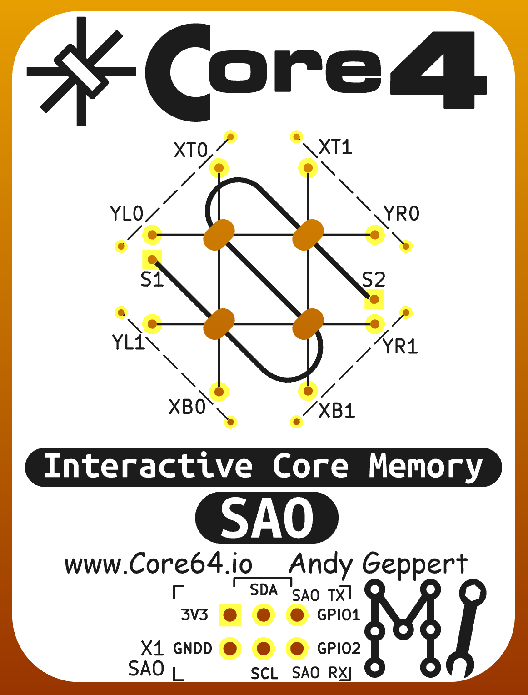
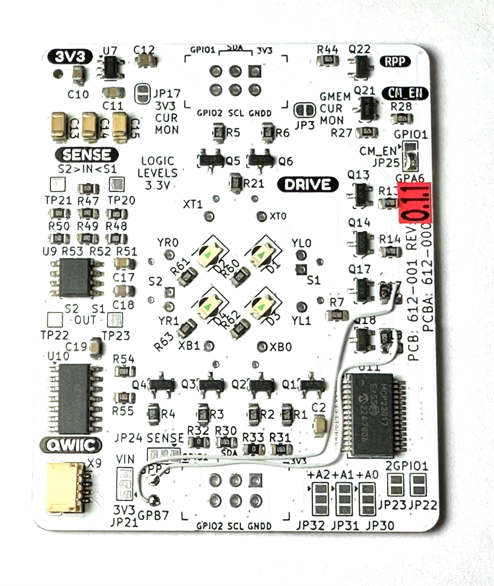
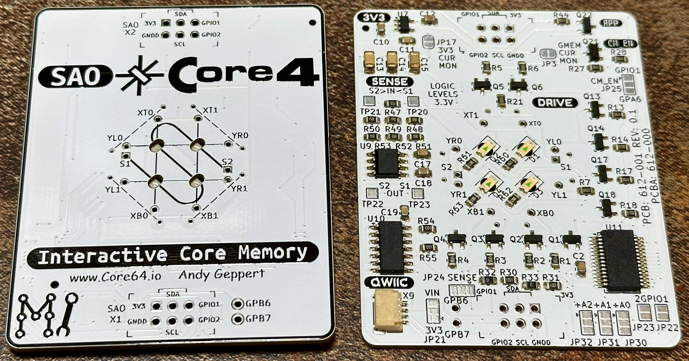
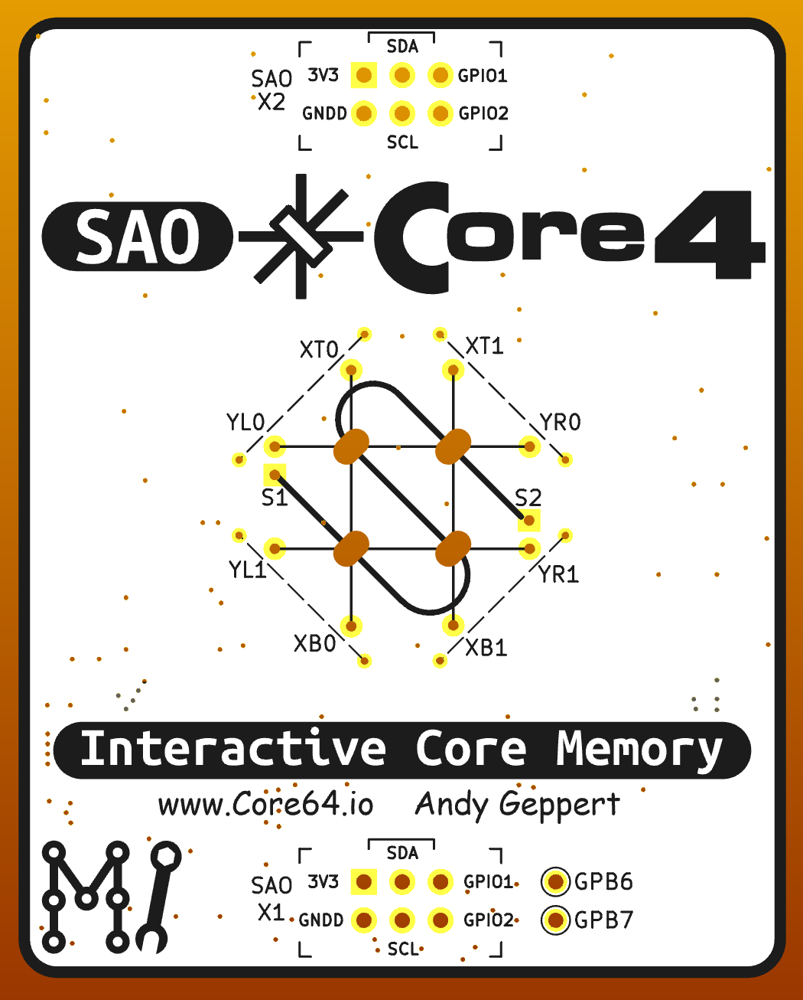

# SAO_CORE4

A Nibble of Core Memory

Follow this project at: https://hackaday.io/project/197235-sao-core4-a-nibble-of-core-memory-with-i2c

Hardware Version 0.2.0 - Work in progres - reducing board size - add button - simplify.

Hardware Version 0.1.1 hand reworked prototype, simplified and re-routed row drive transistor signals to simplify firmware development. This is the version that is currently the functional prototype. These changes will be in 0.2.0.

Hardware Version 0.1 as prototyped

Hardware Version 0.1 render

